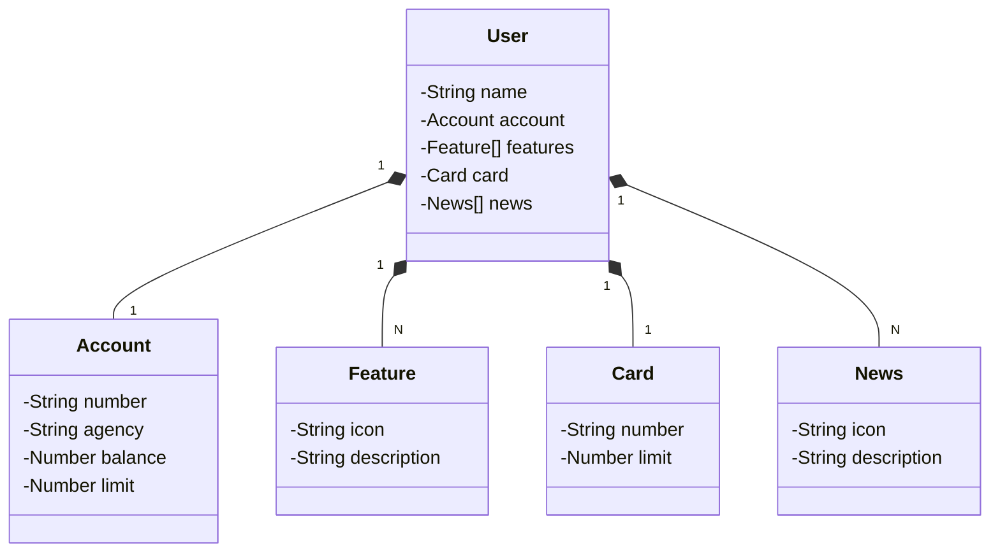

# DIO-JavaRESTfulAPI
O projeto JavaRESTfulAPI é um desafio que visa criar uma RESTful API para o Santander, desenvolvida em Java 17 com Spring Boot 3. Este projeto busca fornecer uma solução eficiente e escalável para atender às necessidades de integração e comunicação de dados da instituição financeira, oferecendo uma abordagem moderna e confiável.

## Principais Tecnologias
 - **Java 17**: Utilizamos a versão LTS mais recente do Java para tirar vantagem das últimas inovações que essa linguagem robusta e amplamente utilizada oferece;
 - **Spring Boot 3**: Trabalhamos com a mais nova versão do Spring Boot, que maximiza a produtividade do desenvolvedor por meio de sua poderosa premissa de autoconfiguração;
 - **Spring Data JPA**: Exploramos como essa ferramenta pode simplificar nossa camada de acesso aos dados, facilitando a integração com bancos de dados SQL;
 - **OpenAPI (Swagger)**: Criamos uma documentação de API eficaz e fácil de entender usando a OpenAPI (Swagger), perfeitamente alinhada com a alta produtividade que o Spring Boot oferece;
 - **Railway**: Facilita o deploy e monitoramento de nossas soluções na nuvem, além de oferecer diversos bancos de dados como serviço e pipelines de CI/CD.

 ## [Link do Figma](https://www.figma.com/file/0ZsjwjsYlYd3timxqMWlbj/SANTANDER---Projeto-Web%2FMobile?type=design&node-id=1421%3A432&mode=design&t=6dPQuerScEQH0zAn-1)

O Figma foi utilizado para a abstração do domínio desta API, sendo útil na análise e projeto da solução.

## Diagrama de Classes (Domínio da API)

## [Clique aqui para acessar a documentação da API (Swagger)](https://dio-javarestfulapi-prd.up.railway.app/swagger-ui.html)

***OBS*** : Esta API ficará disponível no Railway por um período de tempo limitado, por se tratar de uma plataforma gratuita.
